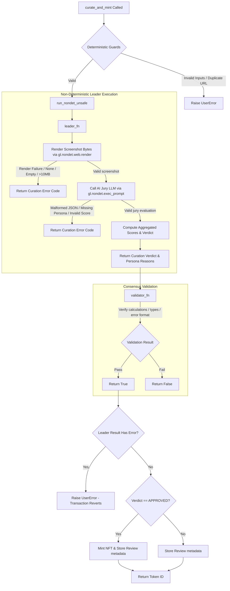

# Walkthrough — AI NFT Studio GenLayer Port

This document details the user flow, smart contract curation mechanics, frontend implementation structure, transaction lifecycles, and verification evidence for the GenLayer Studionet port.

## 1. User Flow

1. **Wallet Connection**:
   - The user opens the dApp. If their wallet is not connected, they are prompted to connect.
   - The application checks the network and switches/adds the **GenLayer Studionet** (Chain ID: `61999` / `0xf22f`).
   - The user's wallet address and native `GEN` token balance are displayed on the header.

2. **Curation Submission**:
   - The user inputs the artwork Title (2-80 characters), Prompt (20-800 characters), and a public HTTPS Image URL (max 500 characters).
   - Form inputs are validated in real-time, giving immediate visual feedback for incorrect formats or length constraints.
   - The user clicks **Submit to AI Consensus Curation**.

3. **Consensus Tracking**:
   - The active pipeline shows real-time transaction progress:
     - **Stage 1 (Submitting)**: Broadcast status of the write contract transaction.
     - **Stage 2 (Consensus)**: Active polling of the block proposal stages (`PROPOSING`, `COMMITTING`, `REVEALING`).
     - **Stage 3 (Finalizing)**: Waiting for network finalization (`FINALIZED`).

4. **Verdict Curation Output**:
   - Once final, if successful (`FINISHED_WITH_RETURN`), the panel displays the detailed scorecard:
     - Individual scores (Alignment, Quality, Originality, Safety) and weighted average.
     - Detailed reason snippets from all three virtual personas (Curator, Skeptic, Ethicist).
     - Success banner showing **APPROVED & MINTED** with the minted token ID.
     - If the result was **REVISE**, the actionable feedback checklist is shown so the user can easily adjust their inputs and retry.
     - If the result was **REJECTED**, a warning is shown due to content policy violations.
   - If the transaction failed (`FINISHED_WITH_ERROR`), the error log is rendered clearly to guide the user.

5. **Artwork Gallery & Ownership Transfer**:
   - The gallery queries the contract dynamically to show all minted artworks owned by the connected user.
   - The user can click **Transfer** on any artwork card, enter a recipient's 42-char hex address, and execute a write contract transaction. The gallery automatically refreshes after finalization.

---

## 2. Contract Flow

The Intelligent Contract is located at [contracts/registry.py](contracts/registry.py).



---

## 3. Frontend Flow

The frontend logic is located at [frontend/app.js](frontend/app.js) and split into:
- **`readClient`**: Configured solely with the `studionet` chain settings. Used for querying balances, fetching total mints, loading gallery items, and reading review metadata without requiring wallet signing permissions.
- **`writeClient`**: Instantiated with the browser extension wallet provider `window.ethereum` and user account address. Used to sign and send `curate_and_mint` and `transfer_artwork` transactions.
- **Dynamic Override Injector**: Scans and overwrites all static anchor links on startup to match environment variables (`VITE_GITHUB_URL` and `VITE_CONTRACT_ADDRESS`) and normalized explorer links.

---

## 4. Transaction Lifecycle

```
[Write Transaction Broadcasted] 
       │
       ▼ (Hash generated)
[Poll getTransaction] ────► statusName == PROPOSING / COMMITTING / REVEALING (Jury voting active)
       │
       ▼ (Reaches ACCEPTED / READY_TO_FINALIZE)
[Call waitForTransactionReceipt] 
       │
       ▼ (Reaches FINALIZED)
[Check txExecutionResultName] 
       ├──► FINISHED_WITH_RETURN (Transaction Succeeded -> load review & gallery)
       ├──► FINISHED_WITH_ERROR  (Transaction Failed -> display failure logs)
       └──► UNDETERMINED         (Jury Consensus Failed -> instruct retry)
```

---

## 5. QA Evidence

### 1. Active Deployment Status
- **Deployed Contract Address**: `0x2676763dBD21891C5D4945d0e20D2108802C0997`
- **Deployment Transaction**: `0x112db6b1595f3f876388f733b2273070a09e32738824205bc6a4c3d108f9e4e3`
- **Explorer URL**: [explorer-studio.genlayer.com/address/0x2676763dBD21891C5D4945d0e20D2108802C0997](https://explorer-studio.genlayer.com/address/0x2676763dBD21891C5D4945d0e20D2108802C0997)

### 2. GenVM Linter Check
```
✓ Lint passed (3 checks)
✓ Validation passed
  Contract: Contract
  Methods: 7 (5 view, 2 write)
```

### 3. Pytest Execution
```
tests/direct/test_registry.py ...............                           [100%]
15 passed in 0.46s
```
Covered tests:
- `test_approved_mint_success` (Happy path approved mint)
- `test_address_normalization_edge_cases` (Normalizing Address/int/bytes/hex/errors)
- `test_duplicate_mint_blocked` (Fails if URL has already been registered)
- `test_transfer_unauthorized_and_success` (Allows transfers only for owner)
- `test_web_render_error` (Reverts on render failure)
- `test_empty_evidence_error` (Reverts on empty rendered bytes)
- `test_oversized_evidence_error` (Reverts on images > 10MB)
- `test_llm_malformed_json_error` (Reverts on malformed JSON outputs)
- `test_llm_missing_persona_error` (Reverts if any persona is omitted)
- `test_llm_non_numeric_score_error` (Reverts on non-numeric or invalid scores)
- `test_pickling_safety_closures` (Checks closures variable serialization safety)
- `test_validator_fn_semantic_rules` (Checks validation consistency checks)
- `test_validator_is_completely_deterministic` (Strict mock verification of zero non-deterministic validator calls)
- `test_low_alignment_returns_revise_without_mint` (Low alignment triggers REVISE verdict and does NOT mint an NFT)
- `test_unsafe_artwork_returns_rejected_without_mint` (Low safety triggers REJECTED verdict and does NOT mint an NFT)
